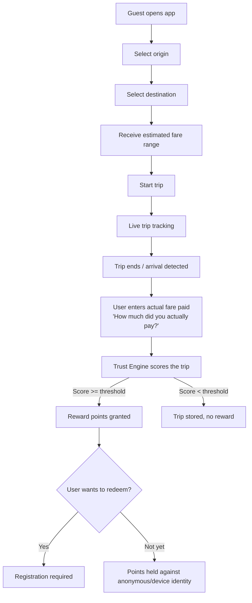

# Product Requirements Document (PRD)

**Product:** Taxi Alexandria Platform (Taxi Tawsila)
**Status:** Draft v1.0 — Phase 1 (Research & Architecture)
**Owner:** Chief Software Architect / Technical Product Owner

---

## 1. Vision

Build the first intelligent digital platform dedicated to **traditional Alexandria taxis**. The platform is not a booking or dispatch product — it is a **transportation intelligence platform** for passengers. It lets riders estimate fares before a trip, track the trip live, record what they actually paid, and — through a verified, anonymized stream of trip data — continuously improve fare-prediction accuracy for everyone.

The accumulated, trust-scored trip dataset is the platform's core long-term asset. Every product decision is subordinate to **data quality**.

## 2. Problem Statement

Traditional Alexandria taxis do not use meters consistently, and fares are negotiated ad hoc. Passengers (residents, tourists, expatriates) have no reliable way to know what a trip *should* cost before getting in the car, which creates friction, overpayment, and mistrust. There is no structured, longitudinal dataset describing real-world taxi fares in Alexandria.

## 3. Non-Goals (Explicit Business Rules)

The platform **must never** implement:

- Taxi booking or hailing
- Driver accounts, driver apps, or driver identity
- Driver-passenger communication
- Driver ratings or reviews
- Ride dispatching or matching

This is a **passenger-only** intelligence and rewards platform. Any feature proposal that requires a driver-facing surface is out of scope by definition and must be rejected at design time.

## 4. Target Users

| Persona | Description | Primary Need |
|---|---|---|
| Resident commuter | Lives/works in Alexandria, takes traditional taxis regularly | Fast, reliable fare estimate; avoid overpaying |
| Tourist / visitor | Unfamiliar with local fares and geography | Trustworthy price expectation; simple UX; no account friction |
| Rewards-motivated user | Frequent rider who wants value back | Points, coupons, redeemable offers |
| Platform admin / ops | Internal staff managing data quality, fraud, merchants | Dashboards, fraud detection tools, campaign management |
| Merchant / advertiser | Local business wanting geo-targeted visibility | Campaign creation, budget control, performance analytics |

## 5. Guiding Product Philosophy

1. **Guest-first**: the app must be fully usable, end-to-end, without registration.
2. **Data quality over feature velocity**: no feature ships if it degrades trip-data integrity.
3. **Trust is earned per-trip**, not per-user: every trip is independently scored.
4. **Provider independence**: no third-party service (maps, routing, auth, push) is a hard dependency of the domain model.
5. **Cost discipline**: prefer self-hostable, open-source infrastructure over pay-per-request SaaS APIs.

## 6. Core User Flow

## 7. Core Features (Phase-1 scope reference)

### 7.1 Fare Estimation
- Inputs: origin, destination, computed distance, estimated travel time, a time-of-day/day-of-week traffic profile (static, rule-configured — see ADR-0012), configurable fare-rule set (base fare, per-km rate, time-of-day multipliers, waiting charges).
- **Scope note (added on architecture review, ADR-0012):** MVP models traffic through configurable time-of-day multipliers, not live/real-time traffic data — this is an explicit, named `TrafficProvider` port with a static adapter at MVP (Architecture §4), so future live-traffic responsiveness is an adapter addition, not a redesign. Live-traffic-responsive estimation is a post-MVP enhancement, not a Phase 5 deliverable.
- Output: an **estimated fare range** (min–max), not a single number, reflecting negotiation variance in traditional taxis.
- Fare rules are configuration, not code — editable by admins without a deploy.

### 7.2 Live Tracking
- Real-time position updates during an active trip.
- Displays: current location, traveled route polyline, remaining distance/time, continuously updated estimated fare.
- Must degrade gracefully under poor GPS signal (see Trust Engine §7.3 and Threat Model).

### 7.3 Trip Completion
- On arrival (detected or user-confirmed), ask exactly **one** question: *"How much did you actually pay?"*
- Store both `estimated_fare` and `actual_fare` against the trip record.
- No further friction at this step — minimizing completion friction is critical to data volume.

### 7.4 Trust Engine
- Independent scoring service; every trip receives a `trust_score`.
- Signals include: GPS continuity, duration/distance/speed plausibility, origin/destination consistency, route deviation, GPS signal quality, fare plausibility, duplicate/impossible-trip detection, spoofing indicators.
- Trips below the configured trust threshold **never** generate rewards, and are flagged for admin review / excluded from the ML-ready dataset (or retained but labeled `low_trust` for research purposes — never silently deleted).

### 7.5 Reward Engine
- Verified trips earn points under configurable reward rules.
- Points redeemable via pluggable reward providers (coupons, restaurants, coffee shops, local stores, merchant promotions).
- Redemption requires an account (see §8).

### 7.6 Location Advertisement Engine
- Enterprise-grade geo-targeted advertising: geofencing, destination/route/radius targeting, campaign scheduling, priority, budget limits, impression/click tracking, merchant analytics, future billing hooks.

### 7.7 Admin Dashboard
- Full operational control plane: users, trips, rewards, merchants, ads/campaigns, heatmaps, reports, analytics, configuration, audit logs, monitoring, system health.

### 7.8 Supporting Platforms (Non-Negotiable, added before Phase 2 — see `18-platform-extensions.md`)

These are not user-facing features; they are the mandatory infrastructure that makes §1–2's core thesis ("the accumulated transportation data is the most valuable long-term asset") actually true rather than aspirational:

- **Data Quality Platform** — every trip gets an independently-computed Data Quality Score (component scores for GPS, Route, Fare, User Input, Device Signals, plus an overall score), explicit provenance on every important computed value, versioned/reproducible calculations, a `readinessStatus` (`READY_FOR_AI`/`LOW_QUALITY`/`MISSING_DATA`/`SUSPICIOUS`/`UNDER_REVIEW`), and a Manual Review Queue gating anything ambiguous before it can ever enter a future ML dataset. This is structurally independent of the Trust Engine (§7.4/ADR-0019): a trip can be reward-verified and simultaneously not yet trusted as training data — both outcomes are legitimate and expected.
- **Feature Management Platform** — feature toggles, percentage rollouts, environment/city scoping, emergency kill switches, user segments, and A/B experiments, all admin-configurable without a deploy (ADR-0018).
- **Configuration Platform** — every business-rule value referenced anywhere in this document (minimum trust score, reward points/multipliers/daily limits, fare rules, GPS/fraud thresholds, advertisement radius, campaign priority, rate limits, time-based multipliers) is versioned, auditable, rollback-capable, and effective-date-aware — never hardcoded (ADR-0017).
- **Fare Policy Engine** — fare business rules (government fare policy, base fare, distance/waiting/time-of-day rules, special adjustments) are owned independently of the Fare Estimation orchestration described in §7.1, so every historical trip remains reproducible against the exact fare policy version that priced it (ADR-0021).

## 8. Registration Policy

- **Guest mode is fully functional** for estimate → track → complete → earn (points accrue against a durable anonymous/device identity).
- Registration becomes **mandatory only** for: reward redemption, point synchronization across devices, multi-device access, account recovery.
- Supported identity methods: OTP (phone), Google Sign-In, Apple Sign-In.
- Registration is never a gate on first use.

## 9. Success Metrics (initial set — refined in Scalability/Analytics phases)

- **Data quality**: % of trips reaching `trust_score >= threshold` ("verified rate") **and** % of trips reaching `readinessStatus = READY_FOR_AI` ("dataset-ready rate") — tracked separately, since they answer different questions (ADR-0019).
- **Estimation accuracy**: mean absolute percentage error between estimated-range midpoint and actual fare, trending down over time.
- **Activation**: % of guest sessions completing a full trip (estimate → actual fare entry).
- **Retention**: repeat-trip rate per anonymous/device identity and per registered user.
- **Reward health**: verified-trip-to-redemption conversion; fraud/abuse rate (trips rejected by Trust Engine).
- **Advertising health**: impression/click-through rate per campaign; merchant retention.

## 10. Constraints

- Must run cost-effectively at city scale without per-request SaaS billing shock (see Cost Strategy in Architecture doc).
- Must be architected so **additional Egyptian cities**, **additional reward/ad providers**, and **future AI-based fare prediction** are additive, not rewrites.
- Must comply with data-protection expectations for location data (see Security Model, Threat Model).

## 11. Out of Scope for MVP (tracked, not forgotten)

- In-app payments / wallet cash top-up (points are earned, not purchased).
- Real-time driver-side integration of any kind.
- Multi-language beyond Arabic/English at MVP (architecture must not preclude it).
- Full ML fare-prediction model (data platform must be ML-ready; model training is a post-MVP phase).
