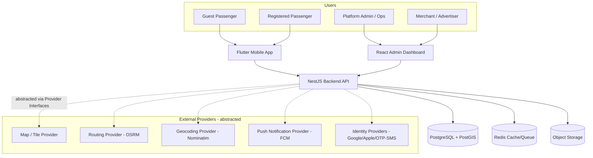
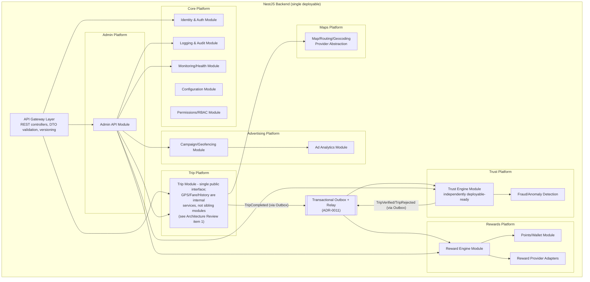

# System Architecture

**Status:** Draft v1.0 — Phase 1

## 1. Architectural Style

**Modular monolith backend, provider-abstracted, event-informed.**

Rationale: at MVP scale, a distributed microservices architecture adds operational cost (deployment, observability, network reliability) without a corresponding benefit — team size and traffic do not yet justify it. Instead, the backend is built as a **single deployable NestJS application composed of strictly isolated modules**, each owning its own domain, database schema (via Postgres schemas), and public interface. Modules communicate only through explicit application-service interfaces or an internal event bus — never through shared tables or reaching into another module's internals.

This gives us:
- One deployment unit to operate at MVP scale (low ops cost).
- A **seam already in place** to extract any module (e.g., Trust Engine, Advertising Engine) into its own service later, because module boundaries are enforced from day one, not retrofitted.
- Clear ownership boundaries mapped 1:1 to bounded contexts (see Domain Model).

See ADR-0002 (Modular Monolith) and ADR-0008 (Trust Engine Isolation).

## 2. C4 — System Context

## 3. C4 — Container / Module View (Backend)

## 4. Provider Abstraction Layer

**No business logic may directly depend on a third-party SDK or API.** Every external capability is accessed through a domain-owned interface (a "Port" in hexagonal-architecture terms), with one or more swappable "Adapters."

| Port (interface, owned by domain) | MVP Adapter | Future/Alt Adapter |
|---|---|---|
| `MapProvider` | MapLibre/Leaflet + OSM tiles | Self-hosted tile server |
| `RoutingProvider` | Self-hosted OSRM (single small VM, Alexandria-only extract — see ADR-0005 sequencing revision) | Self-hosted OSRM cluster, multi-region |
| `GeocodingProvider` | Self-hosted Nominatim (single small VM, Alexandria-only extract) | Self-hosted Nominatim cluster, multi-region |
| `NotificationProvider` | Firebase Cloud Messaging | Self-hosted push (UnifiedPush) / APNs direct |
| `StorageProvider` | S3-compatible object storage | Self-hosted MinIO |
| `AuthenticationProvider` | OTP via SMS gateway, Google, Apple | Additional OIDC providers, WhatsApp OTP |
| `AnalyticsProvider` | Internal analytics module | Self-hosted (Plausible/Matomo) or external |
| `RewardProvider` | Internal coupon engine | Third-party loyalty/merchant APIs |
| `AdProvider`/`Ad Serving` | Internal campaign engine | N/A (always first-party — core IP) |
| `TrafficProvider` *(added on architecture review, ADR-0012)* | Static time-of-day/day-of-week multiplier read from `FareRuleSet` | Historical-speed-derived or live-traffic adapter, post-MVP |

Each Port is defined as a TypeScript interface (backend) or abstract class (Flutter) in a **shared contracts package**, with the concrete adapter injected via dependency injection / service locator at the composition root. Swapping a provider means writing a new adapter class and changing one DI binding — zero changes to domain/business logic. See ADR-0003.

**Region-awareness (added on architecture review, Improvement Report A5):** `MapProvider`/`RoutingProvider`/`GeocodingProvider` method signatures accept an explicit `cityId`/region parameter from the start, even though the MVP adapter ignores it and always targets the single Alexandria instance. This avoids a call-site-wide interface change when a second city's regional instance is introduced.

## 5. Frontend Architecture

### 5.1 Mobile App (Flutter)
- **Clean Architecture** layering: `presentation` (widgets, state via Riverpod/Bloc) → `domain` (use cases, entities, repository interfaces) → `data` (repository implementations, API clients, local cache).
- Map rendering via `flutter_map` (MapLibre-compatible), never directly coupled to a specific tile vendor.
- Offline-tolerant GPS buffering: trip GPS pings are queued locally and flushed to the backend, so brief connectivity loss doesn't lose trip continuity.
- Guest identity: a durable **device-bound anonymous ID** (UUID persisted in secure local storage) is created on first launch, and is the join-key for trips/points until the user registers, at which point anonymous history is merged into the account (see Domain Model, Identity Context).

### 5.2 Admin Dashboard (React)
- Standard layered SPA: `pages` → `features` (per admin domain: users, trips, rewards, merchants, campaigns) → `shared` (API client, design system components).
- Data-grid heavy; server-driven pagination/filtering against the Admin API module.
- Heatmaps and analytics rendered client-side from aggregated backend endpoints (no raw PII trip data shipped to the browser beyond what an operator's role permits — enforced by RBAC, see Security Model).

## 6. Data Platform Principles

- Every trip record captures structured, ML-ready fields from day one (origin/destination, distance, duration, traffic estimate, estimated/actual fare, trust score, timestamp/day-of-week, anonymized device/user reference) — see Database Schema.
- Anonymization: trip records reference a pseudonymous `rider_ref` (device ID or user ID), never raw PII (phone number, email) in the analytical tables. PII lives only in the Identity module's own schema.
- The schema is designed so a future ML pipeline can read directly from a read replica / analytical schema without touching operational tables.

## 7. Technology Stack

| Layer | Technology | Rationale |
|---|---|---|
| Mobile | Flutter | Single codebase iOS/Android, strong map plugin ecosystem |
| Backend | NestJS (TypeScript, Node.js) | Modular DI-first framework maps directly onto our module/port-adapter architecture |
| Admin Web | React (+ TypeScript) | Mature ecosystem for data-dense admin UIs |
| Database | PostgreSQL + PostGIS | Best-in-class open-source geospatial querying (geofencing, route/radius targeting, distance calc) |
| Routing | OSRM | Open-source, self-hostable, no per-request billing |
| Geocoding | Nominatim | Open-source, self-hostable, OSM-based |
| Maps/Tiles | OpenStreetMap + MapLibre/Leaflet/flutter_map | Open data, no vendor lock-in |
| Push | Firebase Cloud Messaging | Free tier sufficient at MVP; abstracted behind `NotificationProvider` |
| Cache/Queue | Redis | Session cache, rate limiting, background job queue (BullMQ) |
| Object Storage | S3-compatible (MinIO-ready) | Self-hostable, standard API |
| Infra | Docker + Docker Compose (MVP) → Kubernetes-ready | Container-first from day one for portability |

## 8. Cost Strategy

The platform explicitly avoids architectures built around pay-per-request commercial APIs (e.g., Google Maps/Directions/Places billing per call). All chosen defaults (OSM/OSRM/Nominatim/PostGIS) are open-source and self-hostable. **Revised on architecture review (Improvement Report B7):** because a single-city OSM extract makes a self-hosted OSRM+Nominatim footprint cheap from day one (a single small VM, not a cluster), MVP targets **self-hosted infrastructure directly**, skipping an interim hosted-instance stage — there is no cost-optimal reason to stand up a hosted dependency only to migrate away from it shortly after. The Provider Abstraction layer (ADR-0003) still governs the interface either way, so this is a sequencing correction, not a reversal of the self-hosting goal. See ADR-0005 and Deployment Strategy §5.

## 9. Cross-Cutting Concerns

- **Configuration**: environment + database-backed dynamic config (fare rules, trust thresholds, reward rules, feature flags) — admins change behavior without deploys. **Cache invalidation (ADR-0013):** "current effective version" reads are short-TTL cached (10–30s); `TrustThresholdConfig` additionally uses Redis pub/sub invalidation given its incident-response sensitivity — required from the first horizontally-scaled deployment, not added reactively.
- **Logging & Audit**: structured JSON logs; every admin action and trust/reward decision is audit-logged (immutable, append-only) — required for the Trust/Reward integrity story and future dispute resolution.
- **Monitoring**: health endpoints per module, metrics exported (Prometheus-compatible), alerting on Trust Engine anomaly rate spikes and API error rates.
- **Domain Event Delivery (revised, ADR-0011):** every domain event is written to a **transactional outbox** table in the same DB transaction as the state change that produced it, then drained by a relay (a polling worker at MVP, a real broker or CDC relay later) — never a bare in-process `EventEmitter` with no durability guarantee. This is a correctness requirement from Phase 3 onward, not a scale-driven upgrade deferred to later.
- **Rate Limiting**: Redis-backed distributed counters (ADR-0013) for OTP, trip creation, GPS ingestion, and ad-serve endpoints — must be correct under multiple backend instances from the first implementation, since per-instance in-memory limiting silently under-counts abuse the moment a second instance is deployed.

## 10. Multi-City & Extensibility

- `City` is a first-class configuration entity: fare rules, geofences, campaign regions, and map bounds are all scoped by `city_id`. Alexandria is the first row, not a hardcoded assumption.
- New reward providers and ad providers are added as new adapters implementing the existing `RewardProvider`/`AdProvider` ports — no core changes.
- Future AI fare prediction plugs in as an alternate `FareEstimationStrategy` implementation behind the existing Fare Engine interface (rule-based strategy today, ML-based strategy later), selectable per city/route via configuration.
