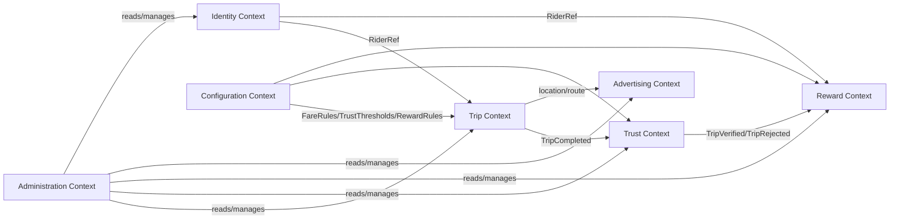

# Domain Model

**Status:** Draft v1.0 — Phase 1

Modeled with Domain-Driven Design: each **Bounded Context** below maps 1:1 to a backend module (see Architecture §1) and a Postgres schema (see Database Schema).

## 1. Bounded Contexts Overview

## 2. Identity Context

**Responsibility:** manage passenger identity across the guest → registered lifecycle. Owns no trip or reward business logic — only "who is this rider."

- **Aggregate: `Rider`**
  - `RiderId` (UUID, stable for life of the identity)
  - `kind`: `GUEST | REGISTERED`
  - `deviceAnonId`: UUID bound at first app launch (guest join-key)
  - `authIdentities[]`: linked OTP phone / Google / Apple identities (only present once registered)
  - `createdAt`, `registeredAt?`
  - Invariant: a `GUEST` rider can be promoted to `REGISTERED` exactly once, preserving `RiderId` — all historical trips/points carry forward (merge-on-registration), never re-keyed.
- **Value Objects:** `PhoneNumber`, `AuthProviderRef`
- **Domain Events:** `RiderRegistered`, `RiderPromotedFromGuest`

## 3. Trip Context

**Responsibility:** the full lifecycle of a single trip: estimate → live tracking → completion.

- **Aggregate Root: `Trip`**
  - `TripId` (UUID)
  - `riderRef` (RiderId, from Identity)
  - `cityId`
  - `origin: GeoPoint`, `destination: GeoPoint`
  - `status`: `ESTIMATED → ACTIVE → COMPLETED → CANCELLED`
  - `estimatedFareRange: { min: Money, max: Money }`
  - `actualFare: Money?` (set only at completion)
  - `route: RoutePolyline` (from RoutingProvider, immutable once trip starts)
  - `distanceMeters`, `estimatedDurationSeconds`
  - `gpsTrack: GpsPing[]` (append-only during ACTIVE)
  - `startedAt`, `completedAt?`
  - Invariants: `actualFare` can only be set when `status = COMPLETED`; `gpsTrack` is append-only and never mutated retroactively (integrity requirement for Trust Engine).
- **Entities:** `GpsPing { lat, lng, accuracy, speed, timestamp }`
- **Value Objects:** `GeoPoint`, `Money`, `RoutePolyline`, `FareRange`
- **Domain Services:** `FareEstimationService` (strategy-pluggable, see Architecture §10), `TripLifecycleService`
- **Domain Events:** `TripStarted`, `TripCompleted { tripId, estimatedFare, actualFare, gpsTrack, route }`, `TripCancelled`

## 4. Trust Context

**Responsibility:** independently evaluate every completed trip and assign a `TrustScore`. Never mutates the `Trip` aggregate directly — Trust is a downstream, independent judgment, by design (auditability, and so trust logic can evolve without touching trip data).

- **Aggregate Root: `TripTrustAssessment`**
  - `TripId` (reference, 1:1 with Trip)
  - `trustScore`: 0–100
  - `signals: TrustSignalResult[]` — one row per rule evaluated (GPS continuity, duration plausibility, distance plausibility, speed plausibility, origin/destination consistency, route deviation, GPS signal quality, fare plausibility, duplicate-trip check, impossible-trip check, spoofing indicators)
  - `verdict`: `VERIFIED | REJECTED | FLAGGED_FOR_REVIEW`
  - `evaluatedAt`, `ruleSetVersion` (so historical assessments are reproducible/auditable against the rule version that produced them)
- **Value Objects:** `TrustSignalResult { signalName, score, weight, detail }`
- **Domain Services:** `TrustScoringEngine` (composes pluggable `TrustSignalEvaluator[]`, each independently unit-testable), `FraudPatternDetector`
- **Domain Events:** `TripVerified { tripId, trustScore }`, `TripRejected { tripId, reason }`
- **Policy:** `verdict = REJECTED` or `trustScore < config.trustThreshold` ⇒ no `TripVerified` event is ever published ⇒ Reward context structurally cannot grant points for it.

## 5. Reward Context

**Responsibility:** points ledger and redemption, decoupled from *how* points are earned via provider adapters.

- **Aggregate Root: `RewardWallet`**
  - `riderRef` (RiderId)
  - `pointsBalance`
  - `ledger: RewardLedgerEntry[]` (append-only: `EARN` from verified trips, `REDEEM` against a `RewardProvider`)
- **Entity: `RewardLedgerEntry { entryId, type, points, sourceTripId?, providerRef?, createdAt }`**
- **Aggregate: `RewardOffer`** (a redeemable item: coupon/merchant promo), owned by a `RewardProvider` adapter, with `pointsCost`, `merchantId`, `validity window`.
- **Domain Services:** `RewardRuleEngine` (points-per-verified-trip, configurable, possibly tiered by trust score/distance), `RedemptionService` (requires `Rider.kind = REGISTERED`, enforced as a domain invariant, not just a UI gate).
- **Domain Events:** `PointsEarned`, `PointsRedeemed`

## 6. Advertising Context

**Responsibility:** merchant campaigns, geo-targeting, and delivery/analytics — entirely first-party, since ad serving is core platform IP.

- **Aggregate Root: `Campaign`**
  - `campaignId`, `merchantId`, `cityId`
  - `targeting: { geofences: Geofence[], routeTargets: RouteTarget[], radiusTargets: RadiusTarget[] }`
  - `schedule: { startAt, endAt, dayparting? }`
  - `priority`, `budget: { limit, spent }`
  - `status`: `DRAFT | ACTIVE | PAUSED | EXHAUSTED | ENDED`
- **Entities:** `Merchant { merchantId, name, cityId, category }`, `Impression { campaignId, riderRef, tripId?, servedAt, context }`, `Click { impressionId, clickedAt }`
- **Domain Services:** `CampaignTargetingEngine` (evaluates active campaigns against a trip's origin/destination/route/live-position and returns priority-ranked matches), `BudgetEnforcementService`
- **Domain Events:** `AdImpressionRecorded`, `AdClicked`, `CampaignBudgetExhausted`

## 7. Configuration Context

**Responsibility:** all tunable platform behavior, versioned and admin-editable without deploys.

- **Aggregates:** `FareRuleSet` (per city: base fare, per-km rate, time-of-day multipliers, waiting charge), `TrustThresholdConfig` (per city: minimum verified score, per-signal weights), `RewardRuleConfig` (points per verified trip, tiering).
- All configuration aggregates are versioned (`effectiveFrom`), never destructively edited, so past trips can be judged against the rules in force at the time.

## 8. Administration Context

**Responsibility:** the operational read/write surface over every other context, gated by RBAC (see Security Model). Not a separate business domain — a composed application layer exposing controlled cross-context operations (audit log, user management, campaign approval, trust-review queue, reports).

## 9. Shared Kernel

Types shared across every context (in a shared package, not duplicated): `Money`, `GeoPoint`, `CityId`, `RiderId`, `TripId`, `Result<T, E>` error-handling convention, domain event envelope `{ eventId, occurredAt, payload }`.
