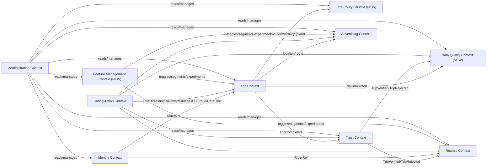

# Domain Model

**Status:** v1.1 — Phase 1, extended with mandatory Data Quality, Feature Management, and Fare Policy platforms before Phase 2 (see `18-platform-extensions.md` for the design reasoning behind this revision; this document is the resulting authoritative model).

Modeled with Domain-Driven Design: each **Bounded Context** below maps 1:1 to a backend module (see Architecture §1) and a Postgres schema (see Database Schema). The platform now has **10 bounded contexts** (7 from Phase 1, 3 added by this revision: Fare Policy, Data Quality, Feature Management).

## 1. Bounded Contexts Overview

## 2. Identity Context

**Responsibility:** manage passenger identity across the guest → registered lifecycle. Owns no trip or reward business logic — only "who is this rider."

- **Aggregate: `Rider`**
  - `RiderId` (UUID, stable for life of the identity)
  - `kind`: `GUEST | REGISTERED`
  - `deviceAnonId`: UUID bound at first app launch (guest join-key)
  - `authIdentities[]`: linked OTP phone / Google / Apple identities (only present once registered)
  - `createdAt`, `registeredAt?`
  - Invariant: a `GUEST` rider can be promoted to `REGISTERED` exactly once, preserving `RiderId` — all historical trips/points carry forward (merge-on-registration), never re-keyed.
  - **Invariant (added on architecture review, ADR-0009):** merge-on-registration only occurs when the device's own local `Rider` is still `GUEST` at the moment of registration. If the auth identity being linked already belongs to a different, existing `REGISTERED` rider, promotion does not happen — the device authenticates into that existing `Rider` instead, and the device's prior guest history is left un-migrated. This closes a cross-account history-injection vector (see Threat Model §2).
- **Value Objects:** `PhoneNumber`, `AuthProviderRef`
- **Domain Events:** `RiderRegistered`, `RiderPromotedFromGuest`

## 3. Trip Context

**Responsibility:** the full lifecycle of a single trip: estimate → live tracking → completion.

- **Aggregate Root: `Trip`**
  - `TripId` (UUID)
  - `riderRef` (RiderId, from Identity)
  - `cityId`
  - `origin: GeoPoint`, `destination: GeoPoint`
  - `status`: `ESTIMATED → ACTIVE → COMPLETED → CANCELLED`
  - `estimatedFareRange: { min: Money, max: Money }`
  - `estimatedFareProvenance: Provenance` (added, ADR-0022): `{ source: FARE_FORMULA | HISTORICAL_MODEL | MANUAL_OVERRIDE, producedByVersion: farePolicyVersionId, computedAt }`
  - `trafficEstimateProvenance: Provenance` (added, ADR-0022): `{ source: TIME_BASED | HISTORICAL_STATISTICAL | LIVE_TRAFFIC_PROVIDER, producedByVersion, computedAt }`
  - `farePolicyVersionId` (added, ADR-0021): reference to the exact `FarePolicyVersion` (Fare Policy Context) used to price this trip
  - `actualFare: Money?` (set only at completion)
  - `route: RoutePolyline` (from RoutingProvider, immutable once trip starts)
  - `distanceMeters`, `estimatedDurationSeconds`
  - `gpsTrack: GpsPing[]` (append-only during ACTIVE)
  - `startedAt`, `completedAt?`
  - Invariants: `actualFare` can only be set when `status = COMPLETED`; `gpsTrack` is append-only and never mutated retroactively (integrity requirement for Trust Engine and Data Quality Engine).
- **Entities:** `GpsPing { lat, lng, accuracy, speed, recordedAt, receivedAt }` — `receivedAt` is server-stamped and cross-checked against `recordedAt` as a trust/data-quality signal (added on architecture review, ADR-0015).
- **Value Objects:** `GeoPoint`, `Money`, `RoutePolyline`, `FareRange`, `Provenance { source, producedByVersion, computedAt }` (shared kernel type, ADR-0022)
- **Domain Services:** `FareEstimationService` — **revised, ADR-0021**: no longer embeds fare-policy business rules. It orchestrates only: call `RoutingProvider` for distance/duration, call `TrafficProvider` for a traffic signal (ADR-0012), call the Fare Policy Context's `FarePolicyEngine.resolveActivePolicy(cityId, now)` + `computeFareRange(policy, distance, duration, trafficSignal)` (synchronous in-process call — Fare Policy is a supporting context queried like Configuration, not event-driven like Trust), then persist the result with provenance. `TripLifecycleService` unchanged.
- **Domain Events:** `TripStarted`, `TripCompleted { tripId, estimatedFare, actualFare, gpsTrack, route }`, `TripCancelled` — published via the transactional outbox with an `eventVersion` and `correlationId` (ADR-0011, revised by ADR-0023/ADR-0027). `TripCompleted` now fans out to **two** independent consumers: Trust Context and Data Quality Context (added, ADR-0019) — neither blocks the other, each idempotent per its own `(consumerName, outboxEventId)` entry in `event_consumption_log`, **not** per `tripId` alone (corrected, ADR-0023 — the prior keying scheme would have broken Data Quality's legitimate re-assessment-after-correction flow).
- **Implementation note (added on architecture review, Review §1):** `GPSMod`/`FareMod`/`HistMod` referenced in the Architecture C4 diagram are internal service classes within this one Trip module/aggregate — not separate bounded contexts or sibling modules with their own public interface.
- **Forward-looking note (added, Pre-Implementation Audit §1):** `Trip` has no `serviceTier`/`vehicleClass` dimension — appropriate for MVP's single traditional-taxi tier, but if the platform ever needs concurrent fare policies for different service tiers in one city, both `Trip` and `FarePolicyVersion`'s resolution key would need this dimension added. Tracked as documented technical debt, not built speculatively now.

## 4. Fare Policy Context *(NEW — ADR-0021)*

**Responsibility:** own fare business rules exclusively — government fare policy, base fare, distance rules, waiting rules, time-of-day rules, special adjustments, and their versioning. Owns no orchestration (routing, traffic lookup) and no trip lifecycle state — those remain in Trip Context, which consumes this context synchronously.

- **Aggregate Root: `FarePolicyVersion`**
  - `id`, `cityId`, `versionLabel` (human-referenceable, e.g. `"ALX-2026-A"`), `governmentReference?` (citation to an official tariff, if one exists)
  - `baseFare: Money`
  - `distanceRules`: tiered per-km brackets (not a single flat rate)
  - `waitingRules`: per-minute waiting charge + free-grace-period allowance
  - `timeOfDayRules`: multipliers by hour bucket / day type (weekday/weekend/holiday) — the concrete, versioned answer to "traffic" as a fare input (ADR-0012)
  - `specialAdjustments`: named surcharges (airport, night, holiday) as a structured rule set
  - `status`: `DRAFT | ACTIVE | SUPERSEDED`, `effectiveFrom`, `rolledBackFrom?` (ADR-0017 versioning shape)
- **Domain Service:** `FarePolicyEngine` — `resolveActivePolicy(cityId, atDate) → FarePolicyVersion`; `computeFareRange(policy, distanceMeters, durationSeconds, trafficSignal) → FareRange`. Pure function of policy + trip metrics; independently, exhaustively table-driven-testable in isolation from routing/traffic orchestration.
- **Domain Events:** `FarePolicyVersionPublished`, `FarePolicyRolledBack` (consumed by Admin/audit; Trip Context does not subscribe — it reads the active version synchronously per trip estimate, it does not react to publish events).
- **Reproducibility guarantee:** every historical `Trip.estimatedFareRange` is reproducible by replaying `computeFareRange` against the trip's stored `farePolicyVersionId` and stored distance/duration/traffic-signal values — a concrete regression-test category (Testing Strategy, amended).

## 5. Trust Context

**Responsibility:** independently evaluate every completed trip and assign a `TrustScore` — a fraud/reward-eligibility judgment. Never mutates the `Trip` aggregate directly — Trust is a downstream, independent judgment, by design (auditability, and so trust logic can evolve without touching trip data). **Distinct from, and structurally independent of, the Data Quality Context (§8) — Trust answers "should this trip earn a reward," Data Quality answers "should this trip's data enter the ML dataset." These can legitimately disagree (ADR-0019).**

- **Aggregate Root: `TripTrustAssessment`**
  - `TripId` (reference, 1:1 with Trip)
  - `trustScore`: 0–100
  - `signals: TrustSignalResult[]` — one row per rule evaluated (GPS continuity, duration plausibility, distance plausibility, speed plausibility, origin/destination consistency, route deviation, GPS signal quality, fare plausibility, duplicate-trip check, impossible-trip check, spoofing indicators)
  - `verdict`: `VERIFIED | REJECTED | FLAGGED_FOR_REVIEW` — **band-derived (fixed, Pre-Implementation Audit §8):** `trustScore >= minVerifiedScore` ⇒ `VERIFIED`; `trustScore >= flaggedReviewMinScore` (but below `minVerifiedScore`) ⇒ `FLAGGED_FOR_REVIEW`; below `flaggedReviewMinScore` ⇒ `REJECTED`. Both thresholds are versioned config (`TrustThresholdConfig`, Configuration Context §9) — previously only `minVerifiedScore` existed as configuration, leaving the `FLAGGED_FOR_REVIEW` boundary partly unmodeled; this now mirrors Data Quality's two-threshold band design (§8) for consistency between two structurally identical judgments.
  - `evaluatedAt`, `trustConfigId` (references the `TrustThresholdConfig` version in force), **`engineVersion`** (added, ADR-0022: semver of the deployed *scoring code*, distinct from the *config* version — both are required for reproducing a historical verdict exactly; a CI check enforces this is bumped whenever scoring logic changes, Coding Standards)
- **Value Objects:** `TrustSignalResult { signalName, score, weight, detail }`
- **Domain Services:** `TrustScoringEngine` (composes pluggable `TrustSignalEvaluator[]`, each independently unit-testable; may share a stateless geo-metrics library with Data Quality's evaluators without sharing business logic — ADR-0019), `FraudPatternDetector` (reads `FraudThresholdConfig`, new in Configuration Context §9)
- **Domain Events:** `TripVerified { tripId, trustScore }`, `TripRejected { tripId, reason }` — published via the transactional outbox (ADR-0011), consumed idempotently by Reward **and** Data Quality.
- **Policy:** `verdict = REJECTED` or `trustScore < config.trustThreshold` ⇒ no `TripVerified` event is ever published ⇒ Reward context structurally cannot grant points for it.
- **Relocation note (ADR-0019):** `TripFeatureSnapshot` — added under this context in a prior review pass (Improvement Report B5) as a stopgap ML-readiness measure — has moved to the Data Quality Context, its correct long-term owner now that Data Quality exists. Trust no longer owns any ML-readiness data structure.

## 6. Reward Context

**Responsibility:** points ledger and redemption, decoupled from *how* points are earned via provider adapters.

- **Aggregate Root: `RewardWallet`**
  - `riderRef` (RiderId)
  - `pointsBalance` — **derived, not independently written** (ADR-0016): computed as `SUM(ledger entries)` inside the same transaction as any new ledger entry; never incremented/decremented as a separate write, which is what prevents a double-redemption race. **May be legitimately negative** following a `CLAWBACK` (ADR-0025) — not itself an error state.
  - `ledger: RewardLedgerEntry[]` (append-only: `EARN` from verified trips, `REDEEM` against a `RewardProvider`, **`CLAWBACK`** — added, ADR-0025 — reversing an `EARN` when Data Quality's Manual Review Queue discovers, after the fact, a duplicate/fraudulent trip Trust's automated check missed)
- **Entity: `RewardLedgerEntry { entryId, type, points, sourceTripId?, providerRef?, rewardRuleConfigId?, clawbackReviewCaseId?, createdAt }`** — `rewardRuleConfigId` added (ADR-0022): every `EARN` entry references the exact `RewardRuleConfig` version that produced its point amount, closing a Phase-1 reproducibility gap. `clawbackReviewCaseId` added (ADR-0025): every `CLAWBACK` entry references the `DataReviewCase` (Data Quality Context §8) that triggered it.
- **Aggregate: `RewardOffer`** (a redeemable item: coupon/merchant promo), owned by a `RewardProvider` adapter, with `pointsCost`, `merchantId`, `validity window`.
- **Domain Services:** `RewardRuleEngine` (points-per-verified-trip, configurable, tiered by trust score/distance via `reward_multiplier_rules`, subject to `dailyPointLimit` — both new Configuration Context fields, §9), `RedemptionService` (requires `Rider.kind = REGISTERED`, enforced as a domain invariant, not just a UI gate; redemption transaction recomputes and validates balance non-negativity per ADR-0016, not a read-then-write across two statements; **additionally blocks any `REDEEM` while the derived balance is non-positive**, ADR-0025 — a standing gate distinct from the per-transaction check, since a `CLAWBACK` can leave the wallet negative until earned back).
- **Domain Events:** `PointsEarned`, `PointsRedeemed`, **`PointsClawedBack`** (added, ADR-0025 — consumed by no other context today, but published via the outbox like every other domain event for consistency and future auditors/notifications).

## 7. Advertising Context

**Responsibility:** merchant campaigns, geo-targeting, and delivery/analytics — entirely first-party, since ad serving is core platform IP.

- **Aggregate Root: `Campaign`**
  - `campaignId`, `merchantId`, `cityId`
  - `targeting: { geofences: Geofence[], routeTargets: RouteTarget[], radiusTargets: RadiusTarget[] }`
  - `schedule: { startAt, endAt, dayparting? }`
  - `priority`, `budget: { limit, spent }`
  - `status`: `DRAFT | ACTIVE | PAUSED | EXHAUSTED | ENDED`
- **Entities:** `Merchant { merchantId, name, cityId, category }`, `Impression { campaignId, riderRef, tripId?, servedAt, context }`, `Click { impressionId, clickedAt }`
- **Domain Services:** `CampaignTargetingEngine` (evaluates active campaigns against a trip's origin/destination/route/live-position and returns priority-ranked matches; default radius and priority tie-break rules now read from `AdvertisingTargetConfig`, Configuration Context §9), `BudgetEnforcementService`
- **V1 simplification (ADR-0014):** `priority`/`budget` pacing exist in the schema from day one, but MVP's `CampaignTargetingEngine` implementation only needs to return the single best-matching active campaign (ties broken by creation order) — full priority-weighted, budget-paced arbitration is deferred until real merchant volume creates genuine overlapping-targeting competition. Evaluation is triggered at trip-lifecycle moments (start, ~60–90s/displacement intervals, completion), never per raw GPS ping, and is pre-filtered by a coarse spatial bucket before precise PostGIS containment.
- **Domain Events:** `AdImpressionRecorded`, `AdClicked`, `CampaignBudgetExhausted`

## 8. Data Quality Context *(NEW — ADR-0019)*

**Responsibility:** independently assess whether a completed trip's recorded data can be trusted for analytics/ML use — a data-fidelity judgment, structurally separate from Trust's fraud/reward-eligibility judgment (§5). Never mutates `Trip` or `TripTrustAssessment` directly.

- **Aggregate Root: `DataQualityAssessment`**
  - `TripId` (reference, 1:1 with Trip)
  - Component scores (each independently computed, 0–100): `gpsScore`, `routeScore`, `fareScore`, `userInputScore`, `deviceSignalScore`
  - `overallScore`: weighted combination per `DataQualityThresholdConfig` (Configuration Context §9)
  - `readinessStatus`: `READY_FOR_AI | LOW_QUALITY | MISSING_DATA | SUSPICIOUS | UNDER_REVIEW`
  - `qualityConfigId` (references `DataQualityThresholdConfig` version), `engineVersion` (semver of deployed quality-scoring code)
  - `evaluatedAt`
  - **Determination order:** `MISSING_DATA` (structural check, cheapest, first) → `SUSPICIOUS` (Trust `REJECTED`, or a hard quality-evaluator veto) → threshold comparison for `READY_FOR_AI` vs. `LOW_QUALITY` vs. the ambiguous `UNDER_REVIEW` middle band.
- **Value Objects:** `DataQualityComponentScore { componentName, score, weight, detail }`, `TripFeatureSnapshot` (relocated here from Trust, ADR-0019: distance, duration, avg/max speed, stop count, route-deviation ratio, time-of-day bucket, day-of-week — the ML-ready per-trip feature vector, persisted at scoring time so it survives raw `gps_ping` retention pruning)
- **Aggregate: `DataReviewCase`** (Manual Review Queue, ADR-0020) — created only when `readinessStatus` lands on `SUSPICIOUS`/`UNDER_REVIEW`:
  - `state`: `PENDING_REVIEW → { APPROVED, REJECTED, MERGED, CORRECTED, ESCALATED }`, with `ESCALATED → { APPROVED, REJECTED, CORRECTED }`
  - `assignedAdminId?`, `mergedIntoTripId?` (only when `MERGED`), `openedAt`, `resolvedAt?`
  - Invariant: `readinessStatus` transitions to `READY_FOR_AI` **only** as a result of `APPROVED` or `CORRECTED` — no automatic time-based promotion exists.
  - `CORRECTED` resolutions that edit a stored trip field write a `MANUAL_OVERRIDE`-provenance entry (ADR-0022) for that field.
- **Domain Services:** `DataQualityScoringEngine` (composes pluggable `DataQualityComponentEvaluator[]`, mirroring Trust's `TrustSignalEvaluator` pattern; may share a stateless geo-metrics library with Trust without sharing business logic)
- **Domain Events:** `DataQualityAssessed { tripId, overallScore, readinessStatus }`, `DataReviewCaseOpened`, `DataReviewCaseResolved { tripId, resolution }` — **`DataReviewCaseResolved` with `resolution IN (MERGED, REJECTED)` is consumed by Reward Context (ADR-0025) to issue a `CLAWBACK` if the trip has a prior `EARN` entry** — the concrete mechanism by which this queue's findings can reverse a reward already paid on Trust's initial (and, in this scenario, mistaken) say-so.
- **Structural enforcement:** `dataquality.ml_ready_trip_dataset` (a database view hard-filtered to `readinessStatus = READY_FOR_AI`) is the only sanctioned read path for any future ML training/export job — mirrors the Trust/Reward firewall pattern from ADR-0008.
- **Disambiguation:** this context's `DataReviewCase` queue is separate from Trust's existing `FLAGGED_FOR_REVIEW` admin queue (`/admin/trust/flagged`) — they resolve different questions and may legitimately disagree for the same trip.

## 9. Configuration Context

**Responsibility:** all tunable business-rule values, versioned and admin-editable without deploys. (Distinct from Feature Management, §10, which governs *whether a code path is active for whom* rather than *what business-rule value applies* — see Platform Extensions §3.1.)

- **Aggregates** (all following the versioned/append-only/rollback-capable shape of ADR-0017):
  - `TrustThresholdConfig` (minimum verified score, **`flaggedReviewMinScore`** — added, Pre-Implementation Audit §8, the previously-missing second threshold defining the `FLAGGED_FOR_REVIEW` band — per-signal weights)
  - `RewardRuleConfig` (points per verified trip, `rewardMultiplierRules` — renamed from `tieringRules` for clarity, `dailyPointLimit` — new)
  - `GpsThresholdConfig` *(NEW)* — min accuracy, max plausible speed, max ping gap, **`maxBatchSizePerRequest`** (added, Pre-Implementation Audit §8 — the GPS ingestion batch-size cap was previously a hardcoded prose constant); shared input to both Trust and Data Quality GPS-related evaluators
  - `FraudThresholdConfig` *(NEW)* — max verified trips/rider/day, min trip interval, duplicate-trip window; input to Trust's `FraudPatternDetector`
  - `AdvertisingTargetConfig` *(NEW)* — default targeting radius, campaign priority tie-break defaults, max active campaigns per spatial bucket, **`minServeIntervalSeconds`/`minDisplacementMeters`** (added, Pre-Implementation Audit §8 — the ad-serve call cadence, ADR-0014, was previously a hardcoded prose recommendation)
  - `RateLimitConfig` *(NEW)* — per-scope (`OTP_REQUEST`, `TRIP_CREATE`, `GPS_INGEST`, `AD_SERVE`) max-requests/window, making the distributed rate limiter (ADR-0013) admin-tunable rather than hardcoded
  - `DataQualityThresholdConfig` *(NEW)* — component score weights, `READY_FOR_AI`/`LOW_QUALITY` score cutoffs
  - `FarePolicyVersion` moved to its own Fare Policy Context (§4) — it has enough independent domain complexity to warrant that, unlike the rest of this list.
- All configuration aggregates are versioned (`effectiveFrom`), never destructively edited, auditable via `admin.audit_log_entry`, and rollback-capable (publish a new version copying a prior one's values) — see ADR-0017 for the unified pattern. Resolution of "current" always tie-breaks on `ORDER BY effectiveFrom DESC, createdAt DESC` (added, Pre-Implementation Audit §6 — previously unspecified for near-simultaneous publishes).
- **High-risk aggregates and dual control (added, ADR-0026):** `TrustThresholdConfig`, `FraudThresholdConfig`, `GpsThresholdConfig`, and `DataQualityThresholdConfig` require a second, different admin's approval (`PENDING_APPROVAL → ACTIVE`, not a single admin's unilateral publish) before a new version takes effect, because misconfiguring any of them directly weakens fraud/quality protection — see Security Model.

## 10. Feature Management Context *(NEW — ADR-0018)*

**Responsibility:** govern whether a feature/code path is active, for which riders, in which environment/city — distinct from Configuration's "what value applies."

- **Aggregate Root: `FeatureFlag`**
  - `key`, `kind`: `TOGGLE | PERCENTAGE_ROLLOUT | KILL_SWITCH | EXPERIMENT`
  - `enabled`, `rolloutPercentage?` (0–100), `environment`: `ALL | LOCAL | STAGING | PRODUCTION`, `cityId?` (null = all cities), `segmentKey?` (null = all riders), `isKillSwitch`, **`riskTier`: `LOW | HIGH`** (added, ADR-0026 — only meaningful when `isKillSwitch = true`)
  - **Resolution rule (percentage rollout):** stateless, deterministic — `hash(riderId or deviceAnonId, flagKey) % 100 < rolloutPercentage`. The same rider always lands on the same side without a stored per-rider row; increasing the percentage only ever adds riders, never reshuffles existing ones.
  - **Kill-switch propagation:** bypasses the standard 10–30s config TTL cache; uses the same Redis pub/sub immediate-invalidation channel reserved for `TrustThresholdConfig` in ADR-0013 (generalized, not duplicated).
  - **Dual control for `riskTier = HIGH` kill switches (added, ADR-0026, Pre-Implementation Audit §5):** toggling a high-risk kill switch (one gating a Trust/Fraud/Reward-relevant path) requires a second, different admin's approval before it takes effect, except via a `SUPER_ADMIN`-only, audit-logged emergency override for declared incidents — closing the gap where any `FEATURE_MANAGER` could otherwise unilaterally disable a safety-critical code path exactly like an ordinary cosmetic flag.
- **Aggregate: `FeatureSegment`** — `key`, declarative JSONB membership rule (rider attributes or explicit allowlist; internal-testing cohorts are just a segment, not a separate mechanism).
- **Aggregate: `FeatureExperiment`** — `key`, weighted `variants[]`, `status`: `DRAFT | RUNNING | PAUSED | CONCLUDED`. Variant assignment uses the same deterministic-hash approach as percentage rollout.
- **Entity:** `FeatureExposureLog { experimentKey, riderId, variantKey, exposedAt }` (append-only, first-exposure-sticky).
- **Domain Events:** `FeatureFlagUpdated`, `KillSwitchToggled` (routed through the fast-invalidation path), `ExperimentConcluded`.
- **Non-goals (explicit, Platform Extensions §2.4):** no client-side SDK with local persistent bucketing, no multi-armed-bandit auto-optimization, no scheduled automatic rollout ramping.

## 11. Administration Context

**Responsibility:** the operational read/write surface over every other context, gated by RBAC (see Security Model). Not a separate business domain — a composed application layer exposing controlled cross-context operations (audit log, user management, campaign approval, trust-review queue, data-quality review queue, fare policy publishing, feature flag management, reports).

## 12. Shared Kernel

Types shared across every context (in a shared package, not duplicated): `Money`, `GeoPoint`, `CityId`, `RiderId`, `TripId`, `Provenance { source, producedByVersion, computedAt }` (added, ADR-0022), `Result<T, E>` error-handling convention, domain event envelope `{ eventId, occurredAt, payload }` (delivered via the transactional outbox, ADR-0011).
