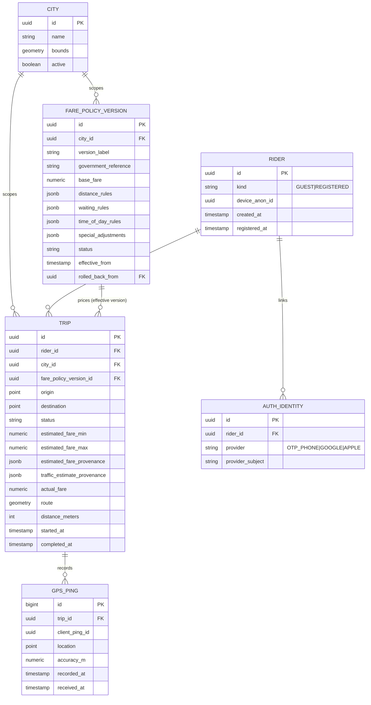
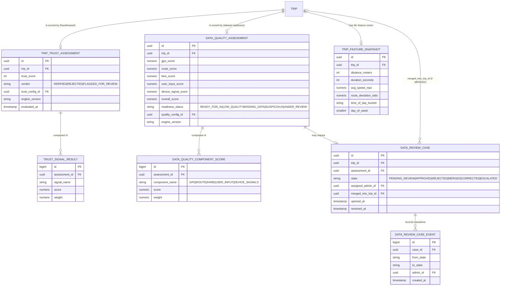
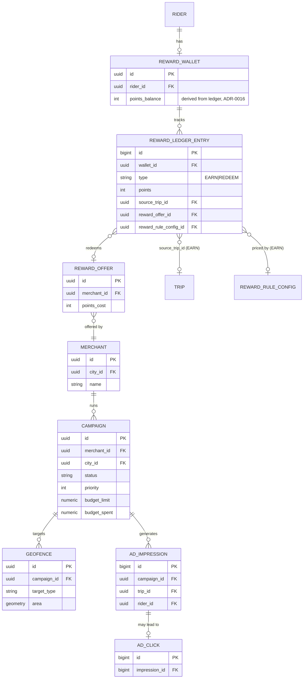
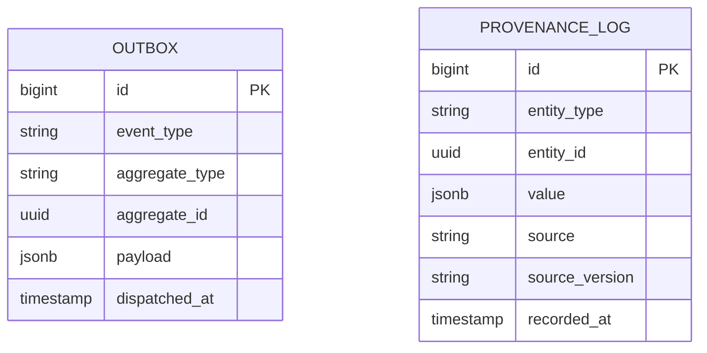

# Entity Relationship Diagram

**Status:** v1.1 — extended with Fare Policy, Data Quality, and Feature Management platforms (see `18-platform-extensions.md`). Corresponds directly to `05-database-schema.md`.

Given the schema now spans 10 bounded contexts, this is split into focused diagrams per cluster rather than one unreadable whole-database diagram. Cross-cluster references (e.g., `TRIP.fare_policy_version_id → FARE_POLICY_VERSION`) are called out in each diagram's notes.

## 1. Core Trip Lifecycle (Identity, Trip, Fare Policy)

**Notes:** `TRIP.fare_policy_version_id` is the reproducibility anchor for pricing (ADR-0021) — no "current config" lookup is ever needed to re-explain a historical fare. `estimated_fare_provenance`/`traffic_estimate_provenance` are inline JSONB snapshots (ADR-0022); the full history of any correction lives in `platform.provenance_log` (§6).

## 2. Trust & Data Quality (independent, parallel consumers of `TripCompleted`)

**Notes:** `TRIP_TRUST_ASSESSMENT` and `DATA_QUALITY_ASSESSMENT` are both 1:1 with `TRIP` but owned by different contexts and independently reproducible (each with its own `engine_version` + config FK — ADR-0022). A trip can be Trust-`VERIFIED` and simultaneously Data-Quality-`UNDER_REVIEW`; this is expected, not a bug (ADR-0019). `dataquality.ml_ready_trip_dataset` (a view, not a table — see Database Schema §8) is the only sanctioned read path filtering to `readiness_status = READY_FOR_AI`.

## 3. Reward & Advertising

## 4. Configuration & Feature Management

```mermaid
erDiagram
    CITY ||--o{ TRUST_THRESHOLD_CONFIG : "scopes"
    CITY ||--o{ REWARD_RULE_CONFIG : "scopes"
    CITY ||--o{ GPS_THRESHOLD_CONFIG : "scopes"
    CITY ||--o{ FRAUD_THRESHOLD_CONFIG : "scopes"
    CITY ||--o{ ADVERTISING_TARGET_CONFIG : "scopes"
    CITY ||--o{ DATA_QUALITY_THRESHOLD_CONFIG : "scopes"
    CITY }o--o{ FEATURE_FLAG : "scopes (nullable = all cities)"

    FEATURE_SEGMENT ||--o{ FEATURE_FLAG : "targets (nullable = all riders)"
    FEATURE_EXPERIMENT ||--o{ FEATURE_EXPOSURE_LOG : "records exposure"
    RIDER ||--o{ FEATURE_EXPOSURE_LOG : "exposed to"

    ADMIN_USER ||--o{ AUDIT_LOG_ENTRY : "performs"
    ADMIN_USER ||--o{ TRUST_THRESHOLD_CONFIG : "publishes"
    ADMIN_USER ||--o{ FARE_POLICY_VERSION_REF : "publishes"

    TRUST_THRESHOLD_CONFIG {
        uuid id PK
        uuid city_id FK
        int min_verified_score
        string status
        timestamp effective_from
        uuid rolled_back_from FK
    }

    REWARD_RULE_CONFIG {
        uuid id PK
        uuid city_id FK
        int points_per_verified_trip
        jsonb reward_multiplier_rules
        int daily_point_limit
        string status
        timestamp effective_from
    }

    GPS_THRESHOLD_CONFIG {
        uuid id PK
        uuid city_id FK
        numeric min_accuracy_meters
        numeric max_plausible_speed_mps
        int max_ping_gap_seconds
        timestamp effective_from
    }

    FRAUD_THRESHOLD_CONFIG {
        uuid id PK
        uuid city_id FK
        int max_verified_trips_per_day
        int duplicate_trip_window_minutes
        timestamp effective_from
    }

    ADVERTISING_TARGET_CONFIG {
        uuid id PK
        uuid city_id FK
        int default_radius_meters
        string priority_tie_break_rule
        timestamp effective_from
    }

    DATA_QUALITY_THRESHOLD_CONFIG {
        uuid id PK
        uuid city_id FK
        jsonb component_weights
        numeric ready_for_ai_min_score
        timestamp effective_from
    }

    FEATURE_FLAG {
        string key PK
        string kind "TOGGLE|PERCENTAGE_ROLLOUT|KILL_SWITCH|EXPERIMENT"
        boolean enabled
        smallint rollout_percentage
        string environment
        uuid city_id FK
        string segment_key FK
        boolean is_kill_switch
    }

    FEATURE_SEGMENT {
        string key PK
        jsonb rule
    }

    FEATURE_EXPERIMENT {
        string key PK
        jsonb variants
        string status
    }

    FEATURE_EXPOSURE_LOG {
        bigint id PK
        string experiment_key FK
        uuid rider_id FK
        string variant_key
    }

    ADMIN_USER {
        uuid id PK
        string email
        string role
    }

    AUDIT_LOG_ENTRY {
        bigint id PK
        uuid admin_user_id FK
        string action
        string entity_type
        string entity_id
    }
```

**Note on the diagram above:** `FARE_POLICY_VERSION_REF` is a shorthand node representing `farepolicy.fare_policy_version` (already fully modeled in Diagram 1) — repeated here only to show that it, too, is published by an `ADMIN_USER` and follows the same versioned/audited shape as every other `config.*` table (ADR-0017). Every table in this diagram (`RATE_LIMIT_CONFIG` not pictured for space) follows the identical `status`/`effective_from`/`rolled_back_from` shape.

## 5. Cross-Cutting Infrastructure (`platform` schema)

**Note:** these two tables have no FK relationships to domain tables by design (`aggregate_id`/`entity_id` are loosely-typed references resolved by `aggregate_type`/`entity_type` string discriminators, not hard FKs) — this is deliberate: the outbox and provenance log must be writable from any schema's transaction without creating a circular or overly rigid cross-schema FK web, and both are append-only audit/delivery mechanisms, not queried relationally in normal operation.
