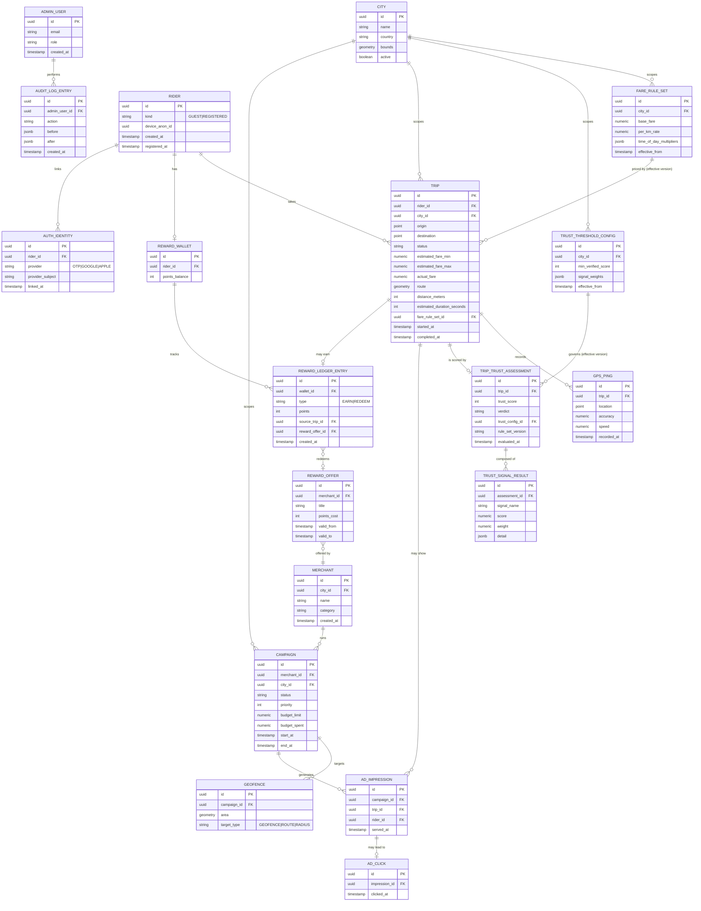

# Entity Relationship Diagram

**Status:** Draft v1.0 — Phase 1

Corresponds directly to the Database Schema (`05-database-schema.md`). Grouped by bounded context/schema.

## Notes

- `FARE_RULE_SET` and `TRUST_THRESHOLD_CONFIG` are **versioned, append-only** configuration tables (`effective_from`); a `TRIP`/`TRIP_TRUST_ASSESSMENT` stores an FK to the exact version in force at evaluation time, not a "current" pointer — required for auditability and reproducibility.
- `RIDER` unifies guest and registered identity under one primary key so trip/reward history never has to be re-keyed on registration (see Domain Model §2).
- `GPS_PING` is intentionally a child table, not embedded JSON, so the Trust Engine can run set-based SQL/PostGIS queries (speed outliers, gaps) directly.
