# Deployment Strategy

**Status:** Draft v1.0 — Phase 1

## 1. Environments

| Environment | Purpose | Data |
|---|---|---|
| `local` | Developer machines | Docker Compose stack: Postgres+PostGIS, Redis, local OSRM/Nominatim (small-region extract), MinIO |
| `staging` | Pre-production validation, QA, demo | Anonymized/synthetic data; mirrors production topology at smaller scale |
| `production` | Real users | Real data, full monitoring/alerting/backups |

Environment parity enforced via the same container images promoted through environments (build once, deploy everywhere) — no environment-specific code branches.

## 2. Containerization

- Every app (`backend`, `admin-web`, `mobile` build artifacts excluded — mobile ships via app stores) has a Dockerfile producing a minimal production image (multi-stage build: install/build stage → slim runtime stage).
- Local dev and staging orchestrated via `docker-compose.yml` (Folder Structure §1 `infra/docker`); production orchestration starts on Docker Compose for MVP simplicity, with Kubernetes manifests (`infra/k8s`) prepared as the scale-up path (Scalability Plan) — no code changes required to move, only orchestration.

## 3. CI/CD Pipeline

```mermaid
flowchart LR
    PR[Pull Request] --> Lint[Lint + Type Check]
    Lint --> Unit[Unit Tests]
    Unit --> Integration[Integration Tests<br/>Testcontainers: Postgres+PostGIS]
    Integration --> Build[Build Docker Images]
    Build --> Security[Dependency/Secret Scan]
    Security --> Merge{Merge to main}
    Merge --> DeployStaging[Auto-deploy to staging]
    DeployStaging --> E2E[E2E Smoke Tests]
    E2E --> ManualGate{Manual approval}
    ManualGate --> DeployProd[Deploy to production]
    DeployProd --> Migrate[Run DB migrations]
    Migrate --> HealthCheck[Post-deploy health check]
```

- CI runs on every PR: lint, type-check, unit tests, integration tests (against ephemeral Testcontainers Postgres+PostGIS), affected-package build (per ADR-0001 monorepo tooling).
- `main` branch auto-deploys to `staging` on merge; production deploys are gated behind manual approval, always preceded by a green staging E2E smoke run.
- Database migrations run as a distinct pipeline step before traffic cutover, and must be backward-compatible with the currently running app version (Coding Standards §8) to support zero-downtime rolling deploys.

## 4. Release Strategy

- **Backend/Admin Web**: rolling deploy behind a load balancer/reverse proxy (health-checked instances swapped in/out); rollback = redeploy previous image tag (immutable, tagged builds — never redeploy from a moving branch ref).
- **Mobile**: standard app-store release channels (internal testing → closed beta → staged rollout → full release), with a remote **emergency kill switch** (`feature.feature_flag`, `isKillSwitch = true` — revised, ADR-0018, supersedes the Phase 1 `config.feature_flag` reference) to disable a problematic new feature without an app-store emergency release. Kill switches propagate via Redis pub/sub (ADR-0013) within seconds of an admin toggle — this is the whole point of distinguishing them from an ordinary feature flag's 10–30s cache TTL, and release runbooks should treat "flip the kill switch" as the first response action for a bad mobile release, before considering an app-store rollback.
- **Migrations**: additive-first (expand/contract pattern) — add new columns/tables in one release, backfill, switch reads, then drop old columns in a later release once no running version depends on them. **Schema migration order** (10 schemas as of this revision) is specified in Database Schema §12: `admin` (bootstrap `admin_user` first, since every versioned-config table across `config`/`farepolicy`/`feature` carries an admin FK) → `config` → `identity` → `farepolicy` → `trip` → `trust`, `reward` → `advertising` → `dataquality` → `feature` → `platform`.

## 5. Routing/Geocoding Infrastructure Sequencing (revised on architecture review, Improvement Report B7)

**MVP targets self-hosted OSRM + Nominatim directly — a single small VM running an Alexandria-only OSM extract — skipping an interim hosted-instance stage.** The original plan implied "hosted first, self-host later once volume justifies it," but a single-city extract makes the self-hosted footprint cheap enough from day one that standing up a hosted dependency only to migrate away from it shortly after is a needless project, not a cost optimization. This is a sequencing correction, not a reversal of the self-hosting goal in ADR-0005.

Capacity growth path (still behind Provider Abstraction Ports, ADR-0003, so no domain-code changes at any step):

1. **MVP (100–10,000 MAU):** one self-hosted VM running OSRM + Nominatim against the Alexandria extract.
2. **Growth (100,000 MAU):** move from one VM to a small self-hosted cluster (2–3 instances behind a load balancer), still one region.
3. **Multi-city / very high scale:** per-region self-hosted instances, selected via the `cityId`/region parameter now part of the `RoutingProvider`/`GeocodingProvider` port signatures (Architecture §4, Improvement Report A5) — no interface change needed when this point is reached.

If a genuinely hosted/managed instance is ever used for short-term delivery speed at some future point (e.g., entering a brand-new city before self-hosted infrastructure is provisioned there), the same Provider Abstraction makes that a temporary adapter choice, reversible without a domain-code change — but it is not the planned MVP path.

## 6. Monitoring & Observability

- Structured JSON logs shipped to a central log store; metrics exported in Prometheus format; dashboards (Grafana or equivalent) for API latency/error rate, Trust Engine verdict distribution, reward-grant rate, campaign delivery volume.
- Alerting thresholds: API 5xx rate, DB connection saturation, Trust Engine anomaly-verdict spike (possible attack or miscalibration), OTP request rate spike (possible abuse).
- Health endpoints per module (Architecture §9) aggregated into `/admin/system/health`.

## 7. Backup & Disaster Recovery

- Automated daily PostgreSQL backups (logical + physical), retained on a rolling window, stored off the primary host.
- Restore procedure tested on a recurring schedule (not just documented) — a restore drill is a release-gate item before public launch (Risk Analysis §5).
- RPO/RTO targets defined before production launch based on business tolerance (initial proposal: RPO ≤ 24h, RTO ≤ 4h for MVP; tightened as the platform matures).

## 8. Secrets & Configuration Management

- Secrets injected via environment variables from a secrets manager (cloud provider secrets store, or Docker/K8s secrets at minimum) — never committed, never baked into images.
- Environment-specific config validated at startup against a strict schema (fail fast on missing/malformed config rather than degrading silently).
