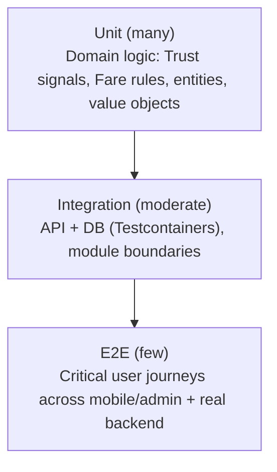

# Testing Strategy

**Status:** Draft v1.0 — Phase 1

## 1. Test Pyramid

Weighting favors unit tests on domain logic — the Trust and Fare engines are pure, framework-free domain code (Folder Structure §2) specifically so they can be exhaustively unit-tested without spinning up infrastructure.

## 2. Backend Testing

- **Unit**: every `TrustSignalEvaluator`, `FareEstimationStrategy`, aggregate invariant, and domain service gets table-driven unit tests covering nominal + edge + adversarial inputs (e.g., zero-distance trips, GPS gaps, teleportation between pings, negative/zero fares). Target near-100% coverage on `domain/` layers.
- **Integration**: each module's `infrastructure` layer (repositories, adapters) tested against a real ephemeral Postgres+PostGIS via Testcontainers — no mocked DB for repository tests. API integration tests exercise controllers end-to-end against the test DB, verifying DTO validation, RBAC guards, and audit-log side effects.
- **Contract tests**: `shared-contracts` DTOs/events versioned; a contract test suite verifies backend responses match the documented API spec/OpenAPI shape, catching drift before it reaches mobile/admin clients.
- **Trust Engine adversarial test suite**: a dedicated fixture set of known fraud patterns (GPS teleportation, duplicate trips, implausible speed, spoofed-location markers) run as regression tests on every change to trust signals — this suite grows every time a real fraud pattern is discovered in production (post-launch feedback loop).

## 3. Mobile (Flutter) Testing

- **Unit**: domain/use-case layer tested independent of Flutter widgets.
- **Widget tests**: key screens (estimate, live tracking, completion question) tested for correct state rendering given mocked repository responses.
- **Integration**: `integration_test` package driving critical flows (guest launch → estimate → start trip → complete trip) against a test backend/staging.
- **GPS/offline behavior**: explicit tests for the offline GPS-buffering path (Architecture §5.1) — simulate connectivity loss mid-trip and verify ping buffering/flush integrity.

## 4. Admin Web (React) Testing

- **Unit/component**: React Testing Library for feature components (forms, data grids), especially RBAC-conditional rendering.
- **Integration**: mocked API layer (MSW) exercising feature flows (approve a flagged trip, create a campaign) including error states.
- **E2E**: Playwright covering the critical admin journeys (trust review approval, campaign creation/pause, config version creation).

## 5. End-to-End (Cross-System)

Critical journeys validated against a real staging deployment before each production release:

1. Guest: open app → estimate fare → start trip → live-track → complete trip → (mocked) trust verification → points reflected.
2. Registration: guest promotes via OTP → historical guest trips/points visible under new account.
3. Redemption: registered rider redeems points for an offer → ledger updated → balance correct.
4. Admin: flagged trip appears in review queue → admin approves/rejects → audit log entry created → reward side effect (if approved) fires correctly.
5. Advertising: campaign created within budget/geofence → served on a matching trip → impression recorded → click recorded → budget decremented.

## 6. Load & Stress Testing

- Load-test the Trip/GPS-ping ingestion path and `/trips/estimate` (highest-frequency endpoints) to validate capacity assumptions before public launch (k6 or similar).
- Stress-test the Trust Engine's event-consumption path under a backlog burst (e.g., many trips completing simultaneously) to confirm no reward-granting race conditions and that queue backpressure behaves correctly.
- Database load testing focused on `gps_ping` write throughput and GiST-indexed geospatial query latency under city-scale simulated concurrency (see Scalability Plan).

## 7. Security Testing

- Dependency/secret scanning gated in CI (Coding Standards §8, Deployment Strategy §3).
- A focused test suite asserting RBAC boundaries (a `SUPPORT_AGENT` token cannot access `SUPER_ADMIN`-only routes, a rider's JWT cannot fetch another rider's trip) is part of the standard integration suite, not a separate one-off audit.
- Formal third-party penetration test recommended before public launch (Risk Analysis §5 / Threat Model §5).

## 8. CI Gating

No PR merges with: failing tests, skipped tests without a tracked follow-up issue, or a coverage regression on `domain/` layers below the agreed threshold (finalized in Phase 2 tooling setup). E2E suite runs against staging post-merge, not per-PR, to keep PR feedback fast.
