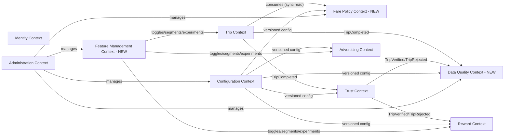
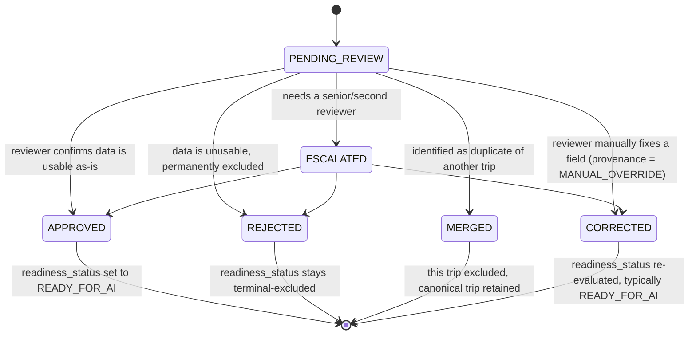

# Platform Extensions: Data Quality, Feature Management, Configuration, Fare Policy Engine

**Status:** v1.0 — mandatory architectural extension, added before Phase 2 begins. These four platforms exist because the platform's stated long-term asset is the *quality* of its transportation data (PRD §1–2), and none of the Phase 1 architecture made data quality an independently governed, auditable concern — it was implicit in Trust Engine scoring alone. This document designs the four platforms and states exactly how they connect to everything already specified in `02-architecture.md` through `17-architecture-improvements.md`.

**How this changes the bounded-context map:** the platform now has **10** bounded contexts, not 7. Three are new: **Fare Policy**, **Data Quality**, **Feature Management**. See `03-domain-model.md` for the full, renumbered domain model; this document is the reasoning behind the design, not a restatement of it.

---

## 1. Data Quality Architecture

### 1.1 What problem this solves, precisely

The Trust Engine (ADR-0008) already answers one question well: *is this trip legitimate enough to pay a reward for?* It does not answer a different question the business also needs answered: *is this trip's recorded data good enough to train a model on, or to count in an analytics report?* Those are not the same question. A completely honest, non-fraudulent trip can still have poor GPS accuracy, a missing waiting-time field, or an implausible-but-not-fraudulent fare entry (a typo, not a scam) — none of that makes it a *fraud* case for Trust, but all of it makes it *bad training data* for Data Quality. Conflating the two would either make Trust Engine sprawl into a second responsibility it wasn't designed for, or leave data quality as an unowned, implicit assumption — which is what Phase 1 actually did.

**Decision: Data Quality is a separate bounded context, structurally independent of Trust, that consumes Trust's verdict as one input among several, not as its own decision.**

### 1.2 Data Quality Score

Every completed trip gets a `DataQualityAssessment` (schema `dataquality`, 1:1 with `Trip`, same isolation pattern as `TripTrustAssessment`) with five **independently computed** component scores plus one overall score:

| Component | What it measures | Example signals (not exhaustive — see `TrustSignalEvaluator` precedent, same pluggable-evaluator pattern) |
|---|---|---|
| GPS | Precision/completeness of location data, independent of fraud intent | Ping density, accuracy distribution, gap count/duration, satellite-fix quality flags |
| Route | How well the recorded track matches a coherent, drivable path | Route-deviation ratio vs. RoutingProvider-computed path, backtrack count, off-road-point ratio |
| Fare | Plausibility and completeness of the fare data itself | Actual-fare field present/well-formed, within a sane bound vs. estimate (looser bound than Trust's fraud check — this is "does this look like usable data," not "does this look like a scam") |
| User Input | Completeness/consistency of rider-supplied fields | Actual-fare entry latency (did they answer immediately or days later, suggesting a guess), any optional context fields left blank |
| Device Signals | Device/OS-level signal health | Mock-location OS flag state, sensor availability, app version/OS version outlier flags |

**Overall Data Quality Score** = weighted combination of the five components, weights and thresholds versioned via `config.data_quality_threshold_config` (§3 below) — never hardcoded, so a data-science team can retune weighting without a deploy.

**Relationship to Trust Engine's own signals (avoiding duplicated logic):** several raw metrics (GPS accuracy, route deviation) are useful to both Trust and Data Quality, but they answer different questions from the same raw numbers — Trust asks "is this deviation big enough to suggest fraud," Data Quality asks "is this deviation big enough to make the recorded route untrustworthy as training input." Rather than duplicate computation, both contexts may depend on a small **shared, stateless metrics library** (pure functions: `computeRouteDeviation(track, referenceRoute)`, `computeSpeedProfile(track)`, etc., living in `packages/shared-contracts` or a dedicated `packages/geo-metrics` package) that neither context owns business logic in — each context's own scoring/thresholding logic stays independent and separately versioned.

### 1.3 Data Provenance

**Every important computed value stores where it came from, not just what it is.** This is implemented as a small, reusable `Provenance` value object — `{ source: <enum>, producedByVersion: <string>, computedAt: <timestamp> }` — embedded as a JSONB column next to the value it describes, **plus** an append-only `platform.provenance_log` table (mirrors the `platform.outbox` pattern from ADR-0011: cheap, additive, same schema-design philosophy) recording every time a provenance-tagged value is written or corrected, so a value's full history survives even a later "Corrected" review action.

Concretely:

| Value | Lives on | Source enum | Version reference |
|---|---|---|---|
| Estimated fare | `trip.trip.estimated_fare_provenance` | `FARE_FORMULA` \| `HISTORICAL_MODEL` \| `MANUAL_OVERRIDE` | `fare_policy_version_id` |
| Traffic estimate | `trip.trip.traffic_estimate_provenance` | `TIME_BASED` \| `HISTORICAL_STATISTICAL` \| `LIVE_TRAFFIC_PROVIDER` | `TrafficProvider` adapter version (ADR-0012) |
| Trust score | `trust.trip_trust_assessment.engine_version` + `trust_config_id` | (implicit: Trust Engine) | engine code version + config version, both stored |
| Data Quality score | `dataquality.data_quality_assessment.engine_version` + `quality_config_id` | (implicit: Data Quality Engine) | engine code version + config version, both stored |
| Reward points granted | `reward.reward_ledger_entry.reward_rule_config_id` (new FK, closes a Phase-1 gap — see ADR-0022) | (implicit: Reward Rule Engine) | config version |

**Rule: no computed field that feeds a downstream decision (fare, trust, quality, reward) ships without a provenance-capable column.** This is enforced by code review checklist (Coding Standards, amended) and by the schema itself refusing to add such a column without one, going forward.

### 1.4 Data Versioning & Reproducibility

Already partly established (ADR-0010: versioned, append-only config). This extension generalizes it into an explicit platform pattern (**ADR-0017**) and closes three concrete gaps found while designing Data Quality:

1. **Trust Engine code version was conflated with Trust config version.** `trust.trip_trust_assessment` gets a new `engine_version` column (semver of the deployed scoring code) *in addition to* the existing `trust_config_id` (which versions the *threshold/weight configuration*, not the code that applies it). Reproducing a historical verdict requires both: the config in force, and the code logic that interpreted it.
2. **Reward grants didn't reference which reward policy produced them.** `reward.reward_ledger_entry` gets `reward_rule_config_id` for `EARN` entries.
3. **Fare policy version wasn't distinguished from generic "config."** See §4 below — Fare Policy gets its own versioned aggregate and its own bounded context, not a row in the generic `config` schema, because its rule structure has real domain complexity (distance tiers, waiting rules, special adjustments, government references).

**Reproducibility guarantee, stated precisely:** given any historical `Trip` row, it must be possible to reconstruct — from FK/version references alone, no guessing from "whatever config is current now" — exactly which fare policy priced it, which trust engine version/config verified it, which data-quality engine version/config assessed it, and which reward policy paid it. This is now true by construction across all four subsystems, not just the Trip/Trust pair Phase 1 covered.

### 1.5 Dataset Readiness

`dataquality.data_quality_assessment.readiness_status` is one of:

- **`READY_FOR_AI`** — passed quality thresholds, trust-verified (or trust-neutral for quality-only analytics use), no open review case. The *only* status permitted in ML training exports.
- **`LOW_QUALITY`** — overall score below the `READY_FOR_AI` threshold but above the `MISSING_DATA` floor; usable for some analytics (e.g., coarse heatmaps) but excluded from training-grade exports.
- **`MISSING_DATA`** — a required field (e.g., no actual-fare entry, no GPS track at all) is absent; cannot be scored meaningfully.
- **`SUSPICIOUS`** — Trust Engine returned `REJECTED`, or a Data Quality component evaluator flagged an internal inconsistency (e.g., fare recorded before trip completion timestamp) — this is a *quality* judgment informed by, but not identical to, a *fraud* judgment.
- **`UNDER_REVIEW`** — ambiguous enough (component scores disagree sharply, or right at a threshold boundary) that automated classification isn't trusted; routed to the Manual Review Queue (§1.6).

**Determination logic, in order:** `MISSING_DATA` (structural — checked first, cheapest) → `SUSPICIOUS` (if Trust `REJECTED`, or a hard quality-evaluator veto) → threshold comparison against `config.data_quality_threshold_config` for `READY_FOR_AI` vs. `LOW_QUALITY` vs. `UNDER_REVIEW` (the ambiguous middle band).

**Structural enforcement (mirrors ADR-0008's Trust/Reward firewall):** a database view, `dataquality.ml_ready_trip_dataset`, is the *only sanctioned read path* for any future ML training/export job — it hard-filters to `readiness_status = 'READY_FOR_AI'`. A future data pipeline reading anything else (raw `trip`/`gps_ping` tables directly) is, by definition, not using the sanctioned path and should fail review. This is the same "make the wrong thing structurally impossible, not just discouraged" discipline already applied to Reward's dependency on Trust.

### 1.6 Manual Review Queue

**This is a distinct workflow from the existing Trust Review Queue (`/admin/trust/flagged`, Phase 1 API spec) — the two must not be confused or merged.** Trust's queue resolves *"should this trip's rider get a reward."* Data Quality's queue resolves *"should this trip's data enter the training/analytics dataset, and if not as-is, can it be fixed."* A trip can be Trust-verified (reward paid) and simultaneously Data-Quality-`UNDER_REVIEW` (data not yet trusted for ML) — these are legitimately independent outcomes, not a bug.

`dataquality.data_review_case` (1:1 optional with a `Trip`, created only when `readiness_status` lands on `SUSPICIOUS` or `UNDER_REVIEW`) with state machine:

Every transition is recorded in `dataquality.data_review_case_event` (append-only, admin ID + note + timestamp) — the same audit discipline as `admin.audit_log_entry`, but scoped to this workflow specifically so a reviewer's history is queryable per-case without joining the global audit log. **A trip in `SUSPICIOUS`/`UNDER_REVIEW` never becomes `READY_FOR_AI` by any path except a resolved review case** — there is no "auto-promote after N days" escape hatch, because that would silently reintroduce the exact risk (unreviewed low-quality data entering the training set) this whole platform exists to prevent.

---

## 2. Feature Management Architecture

### 2.1 Why this is more than the Phase 1 `feature_flag` table

The original design (`config.feature_flag`: a bare `key → enabled boolean`) was explicitly scoped as "adequate for MVP, revisit at multi-city/percentage-rollout need" (Architecture Review §19). That revisit is now mandatory, not deferred, per this extension's requirements. Feature Management is promoted to its own bounded context (schema `feature`) because it has real domain rules of its own (deterministic bucketing, segment membership, experiment variant assignment) — it is not just a settings screen.

### 2.2 Capability model

| Capability | Mechanism |
|---|---|
| **Feature Toggles** | `feature.feature_flag` row, `kind = 'TOGGLE'`, plain `enabled` boolean. |
| **Percentage Rollouts** | `kind = 'PERCENTAGE_ROLLOUT'`, `rollout_percentage` (0–100). Resolution is **stateless and deterministic**: `hash(riderId or deviceAnonId, flagKey) % 100 < rollout_percentage` — the same rider always lands on the same side of the rollout without needing a stored per-rider assignment row, and the percentage can be dialed up/down live with predictable, stable membership (increasing from 20%→30% only ever *adds* riders, never reshuffles existing ones, because the hash bucket for a given rider/flag pair never changes). |
| **Environment-specific Features** | `environment` column (`ALL`/`LOCAL`/`STAGING`/`PRODUCTION`) — resolved against the requesting backend instance's own environment, never client-supplied. |
| **Emergency Kill Switches** | `is_kill_switch = true`. Bypasses the standard config TTL cache entirely; uses the same Redis pub/sub immediate-invalidation channel already reserved for `TrustThresholdConfig` in ADR-0013 (generalized, not duplicated — see ADR-0018). A kill switch is meant to stop a bad behavior within seconds of an admin toggling it, not within the 10–30s TTL window acceptable for ordinary config. |
| **City-based Features** | `city_id` column (nullable = all cities) — reuses the same `city_id`-scoping convention as every other context (Architecture §10). |
| **User Segment Features** | `feature.feature_segment`: named, declarative membership rules (JSONB — e.g. `{"riderKind":"REGISTERED","minTrustScore":90}`, or an explicit rider-ID allowlist for hand-picked internal/beta cohorts). A flag references a segment key; resolution evaluates the rider against the segment's rule at request time (cheap: it's evaluated against already-available rider attributes, not a live DB scan of all riders). |
| **Internal Testing Features** | Just a segment (`internal_testers`) with an explicit admin/QA-account allowlist rule — not a separate mechanism, avoiding a parallel special-case system. |
| **A/B Experiment Support** | `feature.feature_experiment` (named, weighted variants) + `feature.feature_exposure_log` (append-only, first-exposure-sticky via a unique `(experiment_key, rider_id)` index) — variant assignment uses the same deterministic-hash approach as percentage rollouts (`hash(riderId, experimentKey) % totalWeight` mapped into variant buckets), and the exposure log is what a future analysis join against trip/reward outcomes would use. |

### 2.3 Resolution path (performance-critical, informed by Architecture Review §18/§20 findings)

Feature resolution happens on a meaningful fraction of requests (any client screen gated by a flag, any experiment-bearing flow). It must **never** be a per-request database round-trip at scale. Resolution reads go through the same short-TTL Redis cache pattern established for business-rule config (ADR-0013): flags/segments/experiments are cached with a 10–30s TTL, **except kill switches**, which use pub/sub invalidation for near-immediate propagation. This is the same mechanism, reused, not a new one — Feature Management and Configuration Platform intentionally share their caching/invalidation infrastructure (§3.4).

### 2.4 Non-goals (kept explicit so they aren't quietly built)

No client-side flag SDK with local persistent bucketing, no multi-armed-bandit auto-optimization of experiments, no gradual automatic rollout scheduling (percentage changes are always an explicit admin action). These are legitimate future capabilities but are not needed to satisfy any current PRD requirement, and building them now would be exactly the kind of speculative complexity the Architecture Review already flagged once (Advertising Engine, §6) — the lesson generalizes here.

---

## 3. Configuration Platform Design

### 3.1 Scope clarification

"Configuration Platform" and "Feature Management Platform" are related but answer different questions: Configuration governs **business-rule values** (how much, how strict, what threshold); Feature Management governs **whether a code path is active for whom**. Both share the same versioning/audit/cache mechanics (§3.4), which is why they're designed together in this document, but they remain separate bounded contexts/schemas (`config` vs. `feature`) because their domain rules differ (effective-dated numeric/JSON rule sets vs. deterministic bucketing and segment evaluation).

### 3.2 Complete configuration inventory (closing the "no hardcoded business rules" requirement)

Every item explicitly required, mapped to its owning aggregate:

| Configurable value | Aggregate | Schema |
|---|---|---|
| Minimum Trust Score | `TrustThresholdConfig.min_verified_score` | `config` (existing) |
| Reward Points (per verified trip) | `RewardRuleConfig.points_per_verified_trip` | `config` (existing) |
| Reward Multipliers | `RewardRuleConfig.reward_multiplier_rules` (renamed from `tiering_rules` for clarity) | `config` (existing, renamed) |
| Daily Reward Limits | `RewardRuleConfig.daily_point_limit` (new column) | `config` (existing table, new column) |
| Fare Rules / Fare Policy Versions | `FarePolicyVersion` (base fare, distance rules, waiting rules, time-of-day rules, special adjustments) | `farepolicy` (**new context**, §4) |
| GPS Thresholds | `GpsThresholdConfig` (min accuracy, max plausible speed, max ping gap) | `config` (**new table**) |
| Fraud Thresholds | `FraudThresholdConfig` (max verified trips/day, min trip interval, duplicate-trip window) | `config` (**new table**) |
| Advertisement Radius / Campaign Priority tie-break defaults | `AdvertisingTargetConfig` | `config` (**new table**) |
| Rate Limits | `RateLimitConfig` (scope, max requests, window) | `config` (**new table**) — this is also what closes ADR-0013's "distributed rate limiter" gap: limits themselves become admin-tunable, not hardcoded constants in the limiter middleware. |
| Time-based Multipliers | `FarePolicyVersion.time_of_day_rules` | `farepolicy` |
| Data Quality thresholds/weights | `DataQualityThresholdConfig` | `config` (**new table**) |

### 3.3 Versioned / Auditable / Rollback-capable / Effective-date-aware — formalized as one pattern (ADR-0017)

Every table in §3.2 follows the **same shape**, generalized from ADR-0010:

- `effective_from TIMESTAMPTZ` — when this version takes effect; "current" is resolved as the latest row with `effective_from <= now()`.
- `status` (`DRAFT` / `ACTIVE` / `SUPERSEDED`) — a `DRAFT` version can be prepared and reviewed before it goes live at its `effective_from` moment.
- Append-only: no `UPDATE` to a published version's values, ever — a change is always a new row.
- **Auditable**: every publish is also written to `admin.audit_log_entry` (existing mechanism, no new audit system needed) with the admin actor, before/after values, and timestamp.
- **Rollback-capable, without breaking append-only**: "rollback" is modeled as **publishing a new version whose field values copy a prior version**, with an explicit `rolled_back_from` reference to the version being restored. This gives operators a one-action rollback UX in the Admin Dashboard while preserving full history — there is never a destructive revert, only a new, clearly-labeled version that happens to match old values.

### 3.4 Shared caching/invalidation infrastructure

Both Configuration and Feature Management resolve "current effective version" through the same Redis-backed short-TTL cache + pub/sub-invalidation-for-urgent-cases pattern from ADR-0013, now explicitly generalized (ADR-0018 references ADR-0013 rather than reinventing it) to cover: `TrustThresholdConfig` (already specified), kill-switch feature flags (new), and — recommended, not mandatory — any config value an incident responder might need to change during an active fraud event (`FraudThresholdConfig` is the other clear candidate for pub/sub-speed propagation, alongside trust thresholds).

---

## 4. Fare Policy Engine Design

### 4.1 The separation, precisely

**Fare Policy** = the business rules (what the government/company says a fare *should* be, as a function of distance/time/conditions). **Fare Estimation** = the orchestration that gathers trip-specific inputs (route distance/duration from `RoutingProvider`, a traffic signal from `TrafficProvider`) and asks Fare Policy to price them. Phase 1 had these fused into one `FareEstimationService` reading directly from `config.fare_rule_set`. This extension splits them into two contexts because Fare Policy has real, independent domain complexity (government fare references, tiered distance rules, waiting-time rules, special surcharges) that deserves its own versioned aggregate and its own admin surface, separate from the orchestration logic that merely *consumes* it — the same reasoning that already justified separating Trust from Trip (ADR-0008), applied here.

### 4.2 `FarePolicyVersion` (new aggregate, schema `farepolicy`)

- `cityId`, `versionLabel` (human-referenceable, e.g. `"ALX-2026-A"`), `governmentReference` (optional citation to an official tariff, if one exists)
- `baseFare`
- `distanceRules` — tiered per-km brackets (e.g., higher rate for the first N km, lower rate beyond), not a single flat rate
- `waitingRules` — per-minute waiting charge, with a free-grace-period allowance
- `timeOfDayRules` — multipliers by hour bucket / day type (weekday/weekend/holiday) — this is also the concrete answer to the "traffic" input question raised in the prior Architecture Review (ADR-0012): time-of-day multipliers *are* the MVP traffic proxy, now formally owned by Fare Policy rather than floating in generic config.
- `specialAdjustments` — named surcharges (airport, night, holiday) as a JSON rule set
- `status` / `effectiveFrom` / `rolledBackFrom` — same versioned-config shape as §3.3

### 4.3 `FarePolicyEngine` (domain service)

`resolveActivePolicy(cityId, atDate) → FarePolicyVersion` and `computeFareRange(policy, distanceMeters, durationSeconds, trafficSignal) → FareRange` — a pure function of policy + trip metrics, independently unit-testable with table-driven cases (Testing Strategy already mandates this rigor for the Fare Engine; it now applies to this narrower, purer surface, which is easier to test exhaustively precisely because it no longer also has to orchestrate routing/traffic calls).

### 4.4 How Trip's Fare Estimation consumes it

`Trip` context's `FareEstimationService` becomes a thin orchestrator: call `RoutingProvider` for distance/duration, call `TrafficProvider` for a traffic signal, call `FarePolicyEngine.resolveActivePolicy` + `computeFareRange`, then persist the resulting `FareRange` on the `Trip` aggregate **along with** `farePolicyVersionId` and the `estimated_fare_provenance` JSONB (§1.3). This is an **in-process synchronous call** (Fare Policy is a supporting/generic-subdomain context, queried like Configuration, not reactive like Trust) — no event bus involved, no eventual consistency concern, because fare estimation is on the interactive request path and must return synchronously.

### 4.5 Reproducibility guarantee

Every historical `Trip.estimated_fare_min/max` is reproducible from `trip.fare_policy_version_id` alone — replaying `FarePolicyEngine.computeFareRange` against that exact stored policy version and the trip's stored distance/duration/traffic-signal values must reproduce the original estimate exactly. This is the concrete meaning of "historical trips must always reference the Fare Policy Version used" from the requirements, made testable (it becomes a regression-test category in Phase 5: replay N historical trips against their stored policy version, assert byte-identical output).

---

## 5. Cross-Platform Consistency Notes

- **Event flow addition:** `TripCompleted` (via the transactional outbox, ADR-0011) now fans out to **two** independent consumers — Trust and Data Quality — not one. Both are equally durable (same outbox mechanism), both are idempotent per `tripId`, and neither blocks the other (they compute in parallel, then Data Quality additionally consumes Trust's `TripVerified`/`TripRejected` as a secondary input once available — see §1.5's determination logic).
- **`trip_feature_snapshot` relocates.** The Architecture Review's Improvement Item B5 added this table under the `trust` schema as a stopgap ML-readiness measure before Data Quality existed as a context. It now correctly belongs to `dataquality` (its actual owner going forward) — this is a design correction, tracked explicitly rather than left as orphaned Trust-schema clutter (see ADR-0019 and the Database Schema update).
- **RBAC additions needed:** a `DATA_QUALITY_REVIEWER` role (scoped to the Manual Review Queue only, distinct from `TRUST_REVIEWER`) and a `FEATURE_MANAGER` role (scoped to feature flags/segments/experiments) — see Security Model update.
- **No new external Provider Abstraction ports are required** by any of these four platforms — they are entirely internal architecture, consistent with "long-term value is the data itself," not a third-party dependency.
